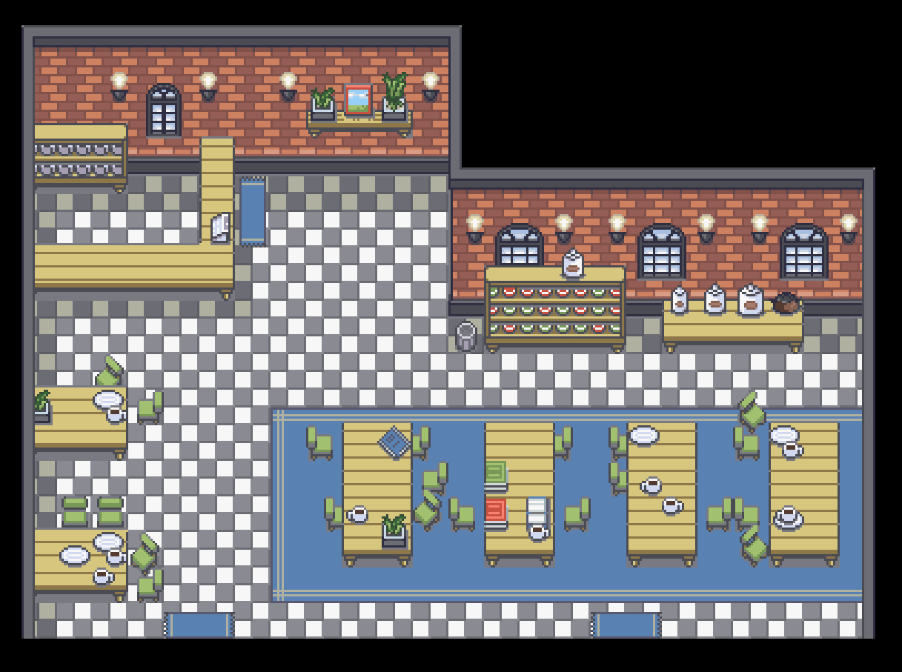
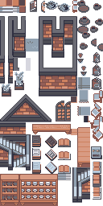

## Brick Cafe Interior
This tileset is derived from Ekat99's "Brick Cafe" tileset on [DeviantArt](https://www.deviantart.com/ekat99/art/Brick-Cafe-888725067), originally designed for use with Pokemon Essentials.

From DeviantArt:
"This is a public use tileset for non-commercial projects. It has been specifically designed for RPG Maker, making it perfect for anyone using a gen 3 style with their project in Pokémon Essentials. If used, please give credit to:

1. Ekat
2. Vurtax (FRLG Rips)
3. Heartlessdragoon (RSE Rips)"

Imported to pokeemerald by Kumatora.

